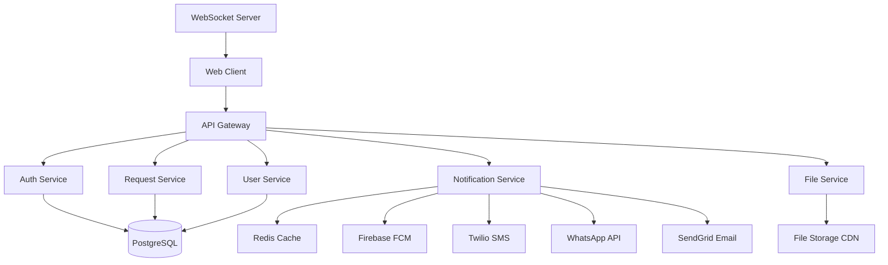
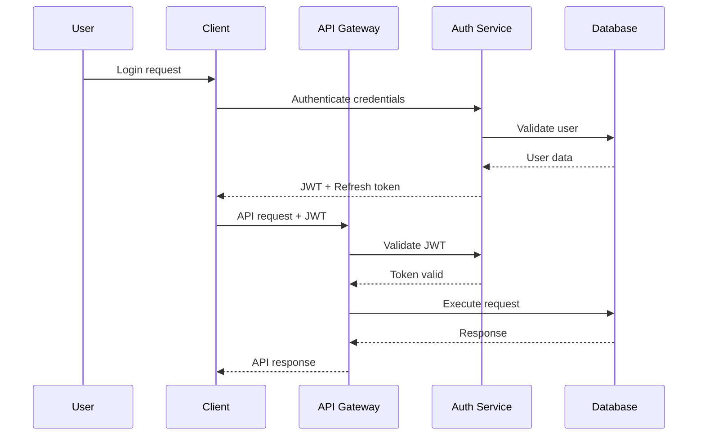

# Zariya FMC Platform - Technical Architecture

## Executive Summary

### Project Overview and Key Architectural Decisions

Zariya FMC Platform is a comprehensive facility management solution that digitizes maintenance workflows across 7 user types: tenants, building associations, and FMC staff. The platform transforms fragmented manual processes into streamlined digital workflows with real-time visibility and multi-channel notifications.

**Key Architectural Decisions:**
- **Microservices Architecture**: Modular services enabling independent scaling and deployment
- **Multi-Tenant SaaS**: Complete data isolation between FMCs with shared infrastructure
- **Real-Time Communication**: WebSocket-based live updates and notifications
- **Mobile-First Design**: Progressive Web App optimized for mobile field workers
- **Cloud-Native Deployment**: Containerized services with orchestration and auto-scaling

### Technology Stack Summary with Rationale

**Frontend Architecture:**
- **React 18 + TypeScript**: Robust component development with type safety and modern React features
- **Vite**: Lightning-fast development and build tooling with modern ES modules
- **TailwindCSS**: Utility-first styling for consistent design system and rapid development
- **React Hook Form + Zod**: Type-safe form validation with excellent DX
- **Tanstack Query**: Powerful server state management with caching and optimistic updates

**Backend Architecture:**
- **Node.js + Express**: Proven JavaScript runtime with extensive ecosystem for rapid development
- **TypeScript**: Type safety across full-stack with shared types between frontend/backend
- **DrizzleORM**: Type-safe SQL query builder with excellent TypeScript integration
- **PostgreSQL**: ACID-compliant relational database ideal for complex business logic
- **Redis**: High-performance caching and session management

**Infrastructure Foundation:**
- **Docker + Kubernetes**: Container orchestration for scalable, reliable deployments
- **Supabase**: Managed PostgreSQL with real-time subscriptions and authentication
- **Firebase**: Push notifications and progressive web app capabilities
- **Coolify**: Self-hosted deployment platform for cost-effective scaling

### System Component Overview



### Critical Technical Constraints and Assumptions

**Constraints:**
- Must support 1000+ concurrent users per FMC tenant
- Sub-3 second page load times on mobile networks
- 99.5% uptime during business hours (6 AM - 10 PM local)
- SOC 2 compliance for enterprise security requirements
- 50MB file upload limit with automatic compression
- Multi-channel notification delivery within 30 seconds

**Assumptions:**
- FMC staff have modern smartphones with camera capabilities
- Internet connectivity available at most maintenance locations
- Users comfortable with progressive web app vs. native mobile app
- English language support initially, with i18n architecture for future expansion

## For Backend Engineers

### API Endpoint Specifications with Exact Schemas

#### Authentication Endpoints

```typescript
// POST /api/auth/login
interface LoginRequest {
  email: string;
  password: string;
}

interface LoginResponse {
  user: User;
  token: string;
  refreshToken: string;
  expiresAt: string;
}

// POST /api/auth/create-profile
interface CreateProfileRequest {
  id: string;
  email: string;
  firstName: string;
  lastName: string;
  role: UserRole;
}
```

#### Maintenance Request Endpoints

```typescript
// POST /api/maintenance-requests
interface CreateMaintenanceRequest {
  title: string;
  description: string;
  category: MaintenanceCategory;
  priority: Priority;
  buildingId: string;
  unitId?: string;
  availableTimeSlots: TimeSlot[];
  attachments?: string[];
}

// GET /api/maintenance-requests
interface GetMaintenanceRequestsQuery {
  status?: RequestStatus;
  buildingId?: string;
  assignedTechnicianId?: string;
  limit?: number;
  offset?: number;
  sortBy?: 'createdAt' | 'priority' | 'dueDate';
  sortOrder?: 'asc' | 'desc';
}

// PATCH /api/maintenance-requests/:id/status
interface UpdateStatusRequest {
  status: RequestStatus;
  notes?: string;
  attachments?: string[];
}
```

#### File Upload Endpoints

```typescript
// POST /api/maintenance-requests/:id/attachments
// Multipart form data with files
interface AttachmentResponse {
  id: string;
  fileName: string;
  fileUrl: string;
  fileSize: number;
  fileType: string;
  isBeforePhoto: boolean;
  uploadedAt: string;
}
```

### Database Schema with Relationships and Constraints

```sql
-- Users table with multi-tenant support
CREATE TABLE users (
  id UUID PRIMARY KEY DEFAULT gen_random_uuid(),
  email VARCHAR(255) UNIQUE NOT NULL,
  first_name VARCHAR(100) NOT NULL,
  last_name VARCHAR(100) NOT NULL,
  role user_role NOT NULL,
  tenant_id UUID REFERENCES tenants(id),
  is_active BOOLEAN DEFAULT true,
  created_at TIMESTAMP DEFAULT now(),
  updated_at TIMESTAMP DEFAULT now()
);

-- Multi-tenant isolation
CREATE TABLE tenants (
  id UUID PRIMARY KEY DEFAULT gen_random_uuid(),
  name VARCHAR(255) NOT NULL,
  slug VARCHAR(100) UNIQUE NOT NULL,
  settings JSONB DEFAULT '{}',
  created_at TIMESTAMP DEFAULT now()
);

-- Buildings and properties
CREATE TABLE buildings (
  id UUID PRIMARY KEY DEFAULT gen_random_uuid(),
  tenant_id UUID REFERENCES tenants(id) NOT NULL,
  name VARCHAR(255) NOT NULL,
  address TEXT NOT NULL,
  building_type building_type NOT NULL,
  settings JSONB DEFAULT '{}',
  created_at TIMESTAMP DEFAULT now()
);

-- Maintenance requests
CREATE TABLE maintenance_requests (
  id UUID PRIMARY KEY DEFAULT gen_random_uuid(),
  tenant_id UUID REFERENCES tenants(id) NOT NULL,
  user_id UUID REFERENCES users(id) NOT NULL,
  building_id UUID REFERENCES buildings(id) NOT NULL,
  title VARCHAR(255) NOT NULL,
  description TEXT,
  category maintenance_category NOT NULL,
  priority priority_level DEFAULT 'medium',
  status request_status DEFAULT 'open',
  assigned_technician_id UUID REFERENCES users(id),
  created_at TIMESTAMP DEFAULT now(),
  updated_at TIMESTAMP DEFAULT now(),
  due_date TIMESTAMP,
  completed_at TIMESTAMP
);

-- Row Level Security for multi-tenancy
ALTER TABLE maintenance_requests ENABLE ROW LEVEL SECURITY;
CREATE POLICY tenant_isolation ON maintenance_requests
  USING (tenant_id = current_setting('app.current_tenant_id')::uuid);
```

### Business Logic Organization Patterns

**Service Layer Architecture:**
```typescript
// services/MaintenanceRequestService.ts
export class MaintenanceRequestService {
  async createRequest(data: CreateMaintenanceRequest, userId: string) {
    // Validate user permissions
    // Create request with tenant isolation
    // Trigger workflow automation
    // Send notifications
    // Return created request
  }

  async assignTechnician(requestId: string, technicianId: string, supervisorId: string) {
    // Validate supervisor permissions
    // Check technician availability
    // Update request assignment
    // Log timeline entry
    // Send notifications
  }
}
```

**Repository Pattern for Data Access:**
```typescript
// repositories/MaintenanceRequestRepository.ts
export class MaintenanceRequestRepository {
  async findByTenantAndFilters(tenantId: string, filters: RequestFilters) {
    return await db.select()
      .from(maintenanceRequests)
      .where(and(
        eq(maintenanceRequests.tenantId, tenantId),
        ...applyFilters(filters)
      ));
  }
}
```

### Authentication and Authorization Implementation Guide

**JWT Token Strategy:**
```typescript
// middleware/auth.ts
export async function authenticateRequest(req: Request, res: Response, next: NextFunction) {
  const token = req.headers.authorization?.replace('Bearer ', '');
  
  if (!token) {
    return res.status(401).json({ error: 'No token provided' });
  }

  try {
    const decoded = jwt.verify(token, process.env.JWT_SECRET) as JWTPayload;
    const user = await getUserById(decoded.sub);
    
    if (!user || !user.isActive) {
      return res.status(401).json({ error: 'Invalid user' });
    }

    req.user = user;
    // Set tenant context for RLS
    await db.execute(sql`SELECT set_config('app.current_tenant_id', ${user.tenantId}, true)`);
    next();
  } catch (error) {
    return res.status(401).json({ error: 'Invalid token' });
  }
}
```

**Role-Based Access Control:**
```typescript
// middleware/rbac.ts
export function requireRole(...roles: UserRole[]) {
  return (req: Request, res: Response, next: NextFunction) => {
    if (!req.user || !roles.includes(req.user.role)) {
      return res.status(403).json({ error: 'Insufficient permissions' });
    }
    next();
  };
}

// Usage
app.patch('/api/maintenance-requests/:id/assign', 
  authenticateRequest, 
  requireRole('fmc_supervisor', 'fmc_head'),
  assignTechnician
);
```

### Error Handling and Validation Strategies

**Centralized Error Handling:**
```typescript
// middleware/errorHandler.ts
export function errorHandler(err: any, req: Request, res: Response, next: NextFunction) {
  const statusCode = err.statusCode || 500;
  const message = err.message || 'Internal Server Error';

  // Log error details
  logger.error({
    error: err,
    request: { method: req.method, url: req.url },
    user: req.user?.id,
    tenant: req.user?.tenantId
  });

  // Don't leak internal details in production
  if (process.env.NODE_ENV === 'production' && statusCode === 500) {
    return res.status(500).json({ error: 'Internal Server Error' });
  }

  res.status(statusCode).json({ error: message });
}
```

**Request Validation with Zod:**
```typescript
// validators/maintenanceRequest.ts
export const createMaintenanceRequestSchema = z.object({
  title: z.string().min(3).max(255),
  description: z.string().max(2000),
  category: z.enum(['plumbing', 'electrical', 'hvac', 'general']),
  priority: z.enum(['low', 'medium', 'high', 'critical']).default('medium'),
  buildingId: z.string().uuid(),
  availableTimeSlots: z.array(timeSlotSchema).min(1)
});

// Usage in route handler
app.post('/api/maintenance-requests', async (req, res) => {
  try {
    const validatedData = createMaintenanceRequestSchema.parse(req.body);
    const result = await maintenanceRequestService.createRequest(validatedData, req.user.id);
    res.status(201).json(result);
  } catch (error) {
    if (error instanceof z.ZodError) {
      return res.status(400).json({ error: 'Validation failed', details: error.errors });
    }
    throw error;
  }
});
```

## For Frontend Engineers

### Component Architecture and State Management Approach

**Component Structure:**
```
src/
├── components/
│   ├── ui/              # Reusable UI components (buttons, inputs, etc.)
│   ├── forms/           # Form components with validation
│   ├── layout/          # Layout components (header, sidebar, etc.)
│   └── feature/         # Feature-specific components
├── pages/               # Page components for routing
├── hooks/               # Custom React hooks
├── stores/              # Zustand stores for global state
├── utils/               # Utility functions
└── types/               # TypeScript type definitions
```

**State Management with Zustand:**
```typescript
// stores/authStore.ts
interface AuthState {
  user: User | null;
  token: string | null;
  isAuthenticated: boolean;
  login: (credentials: LoginCredentials) => Promise<void>;
  logout: () => void;
  refreshToken: () => Promise<void>;
}

export const useAuthStore = create<AuthState>((set, get) => ({
  user: null,
  token: localStorage.getItem('token'),
  isAuthenticated: false,

  login: async (credentials) => {
    const response = await api.post('/auth/login', credentials);
    const { user, token } = response.data;
    
    localStorage.setItem('token', token);
    set({ user, token, isAuthenticated: true });
  },

  logout: () => {
    localStorage.removeItem('token');
    set({ user: null, token: null, isAuthenticated: false });
  }
}));
```

### API Integration Patterns and Error Handling

**React Query for Server State:**
```typescript
// hooks/useMaintenanceRequests.ts
export function useMaintenanceRequests(filters?: RequestFilters) {
  return useQuery({
    queryKey: ['maintenance-requests', filters],
    queryFn: () => api.get('/maintenance-requests', { params: filters }),
    staleTime: 1000 * 60 * 5, // 5 minutes
    onError: (error) => {
      toast.error('Failed to fetch maintenance requests');
    }
  });
}

// Mutation for creating requests
export function useCreateMaintenanceRequest() {
  const queryClient = useQueryClient();
  
  return useMutation({
    mutationFn: (data: CreateMaintenanceRequest) => 
      api.post('/maintenance-requests', data),
    onSuccess: () => {
      queryClient.invalidateQueries(['maintenance-requests']);
      toast.success('Request created successfully');
    },
    onError: (error) => {
      toast.error('Failed to create request');
    }
  });
}
```

**Axios Interceptors for Error Handling:**
```typescript
// utils/api.ts
const api = axios.create({
  baseURL: process.env.VITE_API_URL,
});

api.interceptors.request.use((config) => {
  const token = useAuthStore.getState().token;
  if (token) {
    config.headers.Authorization = `Bearer ${token}`;
  }
  return config;
});

api.interceptors.response.use(
  (response) => response,
  (error) => {
    if (error.response?.status === 401) {
      useAuthStore.getState().logout();
      window.location.href = '/login';
    }
    return Promise.reject(error);
  }
);
```

### Routing and Navigation Architecture

**Wouter for Lightweight Routing:**
```typescript
// App.tsx
function App() {
  return (
    <Router>
      <Routes>
        <Route path="/login" component={LoginPage} />
        <Route path="/dashboard" component={DashboardPage} />
        <Route path="/requests" component={RequestsPage} />
        <Route path="/requests/:id" component={RequestDetailPage} />
        <Route path="/profile" component={ProfilePage} />
        <Route component={NotFoundPage} />
      </Routes>
    </Router>
  );
}
```

**Protected Route Components:**
```typescript
// components/ProtectedRoute.tsx
interface ProtectedRouteProps {
  component: React.ComponentType;
  roles?: UserRole[];
}

export function ProtectedRoute({ component: Component, roles }: ProtectedRouteProps) {
  const { user, isAuthenticated } = useAuthStore();
  
  if (!isAuthenticated) {
    return <Navigate to="/login" />;
  }
  
  if (roles && !roles.includes(user.role)) {
    return <div>Access denied</div>;
  }
  
  return <Component />;
}
```

### Performance Optimization Strategies

**Code Splitting and Lazy Loading:**
```typescript
// Lazy load heavy components
const RequestDetailPage = lazy(() => import('./pages/RequestDetailPage'));
const AnalyticsPage = lazy(() => import('./pages/AnalyticsPage'));

// Usage with Suspense
<Suspense fallback={<LoadingSpinner />}>
  <Route path="/requests/:id" component={RequestDetailPage} />
</Suspense>
```

**Image Optimization:**
```typescript
// components/OptimizedImage.tsx
export function OptimizedImage({ src, alt, ...props }: ImageProps) {
  const [isLoading, setIsLoading] = useState(true);
  const [src, setSrc] = useState(placeholder);
  
  useEffect(() => {
    const img = new Image();
    img.onload = () => {
      setSrc(src);
      setIsLoading(false);
    };
    img.src = src;
  }, [src]);
  
  return (
    <div className="relative">
      
      {isLoading && <div className="absolute inset-0 bg-gray-200 animate-pulse" />}
    </div>
  );
}
```

### Build and Development Setup Requirements

**Vite Configuration:**
```typescript
// vite.config.ts
export default defineConfig({
  plugins: [react()],
  build: {
    target: 'es2020',
    rollupOptions: {
      output: {
        manualChunks: {
          vendor: ['react', 'react-dom'],
          ui: ['@radix-ui/react-dialog', '@radix-ui/react-dropdown-menu'],
          utils: ['date-fns', 'clsx', 'zod']
        }
      }
    }
  },
  server: {
    proxy: {
      '/api': {
        target: 'http://localhost:5000',
        changeOrigin: true
      }
    }
  }
});
```

## For QA Engineers

### Testable Component Boundaries and Interfaces

**Component Testing with React Testing Library:**
```typescript
// __tests__/components/MaintenanceRequestCard.test.tsx
describe('MaintenanceRequestCard', () => {
  const mockRequest = {
    id: '123',
    title: 'Broken faucet',
    status: 'open',
    priority: 'high',
    createdAt: '2025-01-01T00:00:00Z'
  };

  test('displays request information correctly', () => {
    render(<MaintenanceRequestCard request={mockRequest} />);
    
    expect(screen.getByText('Broken faucet')).toBeInTheDocument();
    expect(screen.getByText('High Priority')).toBeInTheDocument();
    expect(screen.getByText('Open')).toBeInTheDocument();
  });

  test('calls onStatusChange when status is updated', async () => {
    const mockOnStatusChange = jest.fn();
    render(
      <MaintenanceRequestCard 
        request={mockRequest} 
        onStatusChange={mockOnStatusChange}
      />
    );
    
    fireEvent.click(screen.getByText('Change Status'));
    fireEvent.click(screen.getByText('In Progress'));
    
    expect(mockOnStatusChange).toHaveBeenCalledWith('123', 'in_progress');
  });
});
```

### Data Validation Requirements and Edge Cases

**Input Validation Test Cases:**

1. **File Upload Edge Cases:**
   - Files exceeding 50MB limit
   - Unsupported file formats
   - Network interruption during upload
   - Corrupted file uploads

2. **Form Validation Edge Cases:**
   - Special characters in text fields
   - SQL injection attempts in form inputs
   - Cross-site scripting (XSS) attempts
   - Unicode character handling

3. **Date/Time Validation:**
   - Timezone handling across different locations
   - Daylight saving time transitions
   - Invalid date formats
   - Future date constraints

**API Endpoint Testing:**
```typescript
// __tests__/api/maintenanceRequests.test.ts
describe('Maintenance Request API', () => {
  test('POST /api/maintenance-requests validates required fields', async () => {
    const response = await request(app)
      .post('/api/maintenance-requests')
      .send({}) // Empty payload
      .expect(400);
      
    expect(response.body.error).toBe('Validation failed');
    expect(response.body.details).toContain('title is required');
  });

  test('handles large file uploads within limits', async () => {
    const largeFile = Buffer.alloc(45 * 1024 * 1024); // 45MB file
    
    const response = await request(app)
      .post('/api/maintenance-requests/123/attachments')
      .attach('files', largeFile, 'large-image.jpg')
      .expect(200);
      
    expect(response.body.fileSize).toBeLessThanOrEqual(50 * 1024 * 1024);
  });
});
```

### Integration Points Requiring Testing

1. **Authentication Flow:**
   - Firebase authentication integration
   - Token refresh mechanism
   - OAuth provider failures
   - Session timeout handling

2. **Notification Delivery:**
   - Push notification delivery confirmation
   - SMS delivery status tracking
   - Email bounce handling
   - WhatsApp message failures

3. **File Storage Integration:**
   - CDN failover scenarios
   - Storage quota exceeded
   - File corruption detection
   - Backup and recovery testing

4. **Database Operations:**
   - Multi-tenant data isolation
   - Transaction rollback scenarios
   - Connection pool exhaustion
   - Database failover testing

### Performance Benchmarks and Quality Metrics

**Performance Targets:**
- Page load time: < 3 seconds on 3G networks
- API response time: < 500ms for 95th percentile
- File upload: < 30 seconds for 50MB files
- Search results: < 1 second for complex queries

**Quality Metrics:**
- Code coverage: > 80% for critical paths
- Accessibility: WCAG AA compliance
- Security: Zero high-severity vulnerabilities
- Performance: Lighthouse score > 90

**Load Testing Scenarios:**
```typescript
// Performance test with k6
export default function() {
  const payload = {
    title: 'Load test request',
    description: 'Testing system under load',
    category: 'general',
    buildingId: '123'
  };

  const response = http.post('http://localhost:5000/api/maintenance-requests', 
    JSON.stringify(payload), {
    headers: { 'Content-Type': 'application/json' }
  });

  check(response, {
    'status is 201': (r) => r.status === 201,
    'response time < 500ms': (r) => r.timings.duration < 500
  });
}
```

### Security Testing Considerations

**Security Test Cases:**
1. **Authentication Security:**
   - Brute force attack prevention
   - Session hijacking protection
   - Token tampering detection

2. **Authorization Testing:**
   - Role-based access control bypass attempts
   - Privilege escalation testing
   - Multi-tenant data leakage

3. **Input Validation Security:**
   - SQL injection testing
   - Cross-site scripting (XSS) prevention
   - File upload security (malicious files)

4. **API Security:**
   - Rate limiting effectiveness
   - CORS policy validation
   - API key exposure prevention

## For Security Analysts

### Authentication Flow and Security Model

**Multi-Layer Authentication Architecture:**

1. **Primary Authentication:** Firebase Authentication with Google OAuth2 and email/password
2. **API Authentication:** JWT tokens with RS256 signing algorithm
3. **Session Management:** Refresh token rotation with secure HTTP-only cookies
4. **MFA Support:** OTP verification for sensitive operations

**Security Flow:**


**Token Security:**
- JWT access tokens: 15-minute expiry
- Refresh tokens: 30-day expiry with rotation
- Secure token storage in HTTP-only cookies
- Token blacklisting for logout/revocation

**Multi-Tenant Security:**
- Row-Level Security (RLS) in PostgreSQL
- Tenant ID validation in all API requests
- Complete data isolation between tenants
- Tenant-specific encryption keys

### Data Protection and Privacy

**Data Encryption Strategy:**
- **At Rest:** AES-256 encryption for sensitive data fields
- **In Transit:** TLS 1.3 for all communications
- **Application Level:** Sensitive PII encrypted before database storage
- **Key Management:** Rotating encryption keys with cloud KMS

**Privacy Controls:**
- GDPR compliance for EU users
- Data retention policies with automated cleanup
- User consent management for data processing
- Data portability and deletion capabilities

**Sensitive Data Handling:**
```typescript
// Example: Encrypting sensitive user data
interface EncryptedUserData {
  id: string;
  email: string; // Plain text for authentication
  encryptedPhone: string; // Encrypted PII
  encryptedAddress: string; // Encrypted PII
  tenantId: string;
}

async function encryptSensitiveFields(userData: UserData): Promise<EncryptedUserData> {
  return {
    ...userData,
    encryptedPhone: await encrypt(userData.phone),
    encryptedAddress: await encrypt(userData.address)
  };
}
```

### Access Control and Authorization

**Role-Based Access Control (RBAC):**

| Role | Permissions | Scope |
|------|-------------|-------|
| Customer (Tenant) | Create/view own requests | Own premises only |
| Building Association | View building requests | Building level |
| FMC Head | Full administrative access | Tenant level |
| FMC Supervisor | Manage requests and staff | Assigned buildings |
| FMC Technician | Update assigned requests | Own tasks only |
| FMC Procurement | Manage materials/vendors | Tenant level |
| Third-Party Support | Limited task access | Specific assignments |

**Permission Matrix:**
```typescript
const permissions = {
  'maintenance-requests': {
    create: ['customer', 'fmc_head', 'fmc_supervisor'],
    read: ['customer', 'building_association', 'fmc_head', 'fmc_supervisor', 'fmc_technician'],
    update: ['fmc_head', 'fmc_supervisor', 'fmc_technician'],
    delete: ['fmc_head'],
    assign: ['fmc_head', 'fmc_supervisor']
  },
  'users': {
    create: ['fmc_head'],
    read: ['fmc_head', 'fmc_supervisor'],
    update: ['fmc_head', 'fmc_supervisor', 'self'],
    delete: ['fmc_head']
  }
};
```

### Security Monitoring and Incident Response

**Security Monitoring:**
- Real-time authentication failure alerts
- Suspicious activity pattern detection
- API rate limiting breach notifications
- Data access anomaly detection
- File upload malware scanning

**Audit Logging:**
```typescript
interface SecurityAuditLog {
  timestamp: string;
  userId: string;
  tenantId: string;
  action: string;
  resource: string;
  ipAddress: string;
  userAgent: string;
  success: boolean;
  riskLevel: 'low' | 'medium' | 'high' | 'critical';
}
```

**Incident Response Plan:**
1. **Detection:** Automated alerts for security events
2. **Assessment:** Risk level determination and impact analysis
3. **Containment:** Automatic account lockdown for critical threats
4. **Investigation:** Comprehensive audit trail analysis
5. **Recovery:** Service restoration and security patch deployment
6. **Post-Incident:** Security review and process improvement

### Compliance and Regulatory Requirements

**SOC 2 Type II Compliance:**
- Security: Access controls and authentication
- Availability: System uptime and disaster recovery
- Processing Integrity: Data processing accuracy
- Confidentiality: Data protection and encryption
- Privacy: Personal data handling and consent

**GDPR Compliance Features:**
- Right to access: User data export functionality
- Right to rectification: Profile update capabilities
- Right to erasure: Account deletion with data purging
- Data portability: Structured data export
- Consent management: Granular privacy preferences

**Security Controls Implementation:**
- Penetration testing: Quarterly security assessments
- Vulnerability scanning: Automated daily scans
- Security awareness training: Monthly team sessions
- Incident response drills: Quarterly exercises
- Compliance audits: Annual third-party reviews

---

*This architecture document serves as the technical blueprint for implementing the Zariya FMC Platform. All implementation teams should refer to their respective sections and coordinate on shared interfaces and dependencies.*